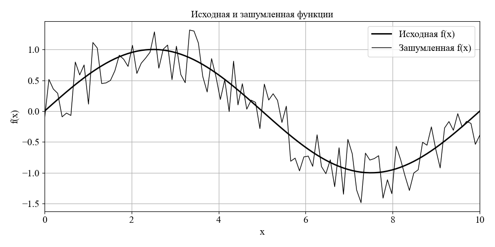
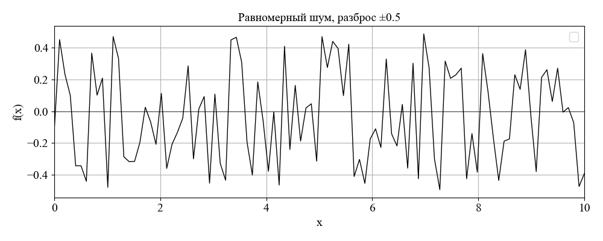
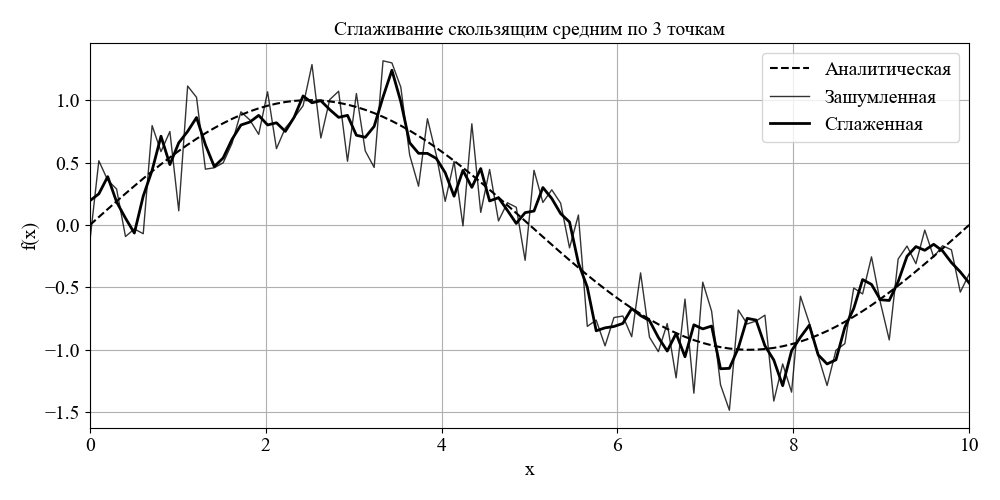
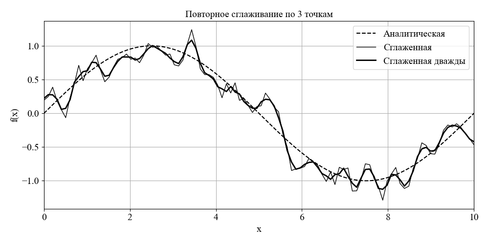
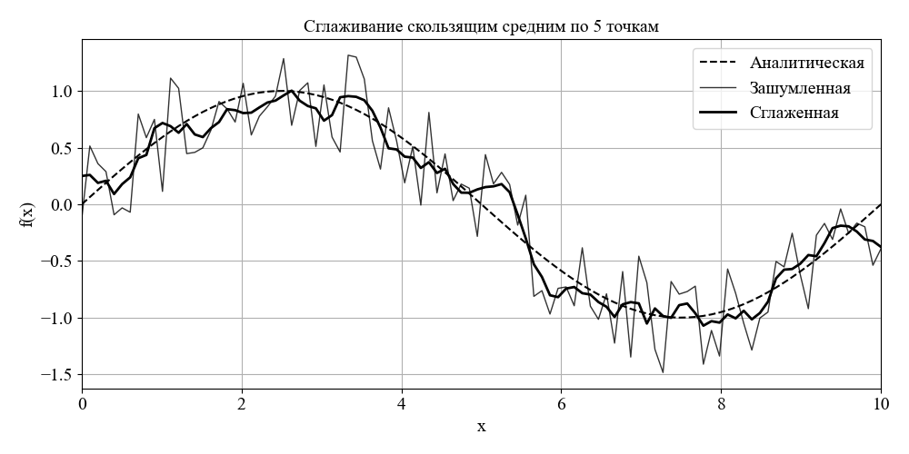
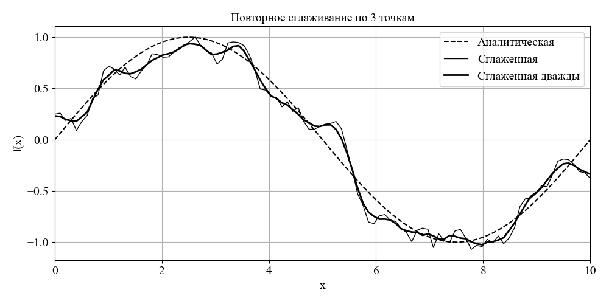

# sliding_average

## Задание
В данной работе выполняется сглаживание зашумленного сигнала с помощью скользящего среднего по нескольким точкам.

Необходимо выполнить следующие пункты:
- Привести графики исходной и зашумленной функций используя функцию случайного, равномерно распределенного шума.
- Привести график равномерно распределенного шума с заданным разбросом шума
- Написать программу сглаживания – скользящее среднее по трем точкам
- Проверить действие алгоритма- скользящего среднего, построив графики зашумленной и сглаженной функций.
- Написать программу повторного сглаживания и привести сравнения сглаженной функции и аналитической.
- Написать программу сглаживания по пяти точкам проделав пункты 1-5.
- Написать выводы по работе.

## Исходные данные

Задана следующая аналитическая функция:
$f(x) = \sin\!\left(\frac{2\pi x}{L}\right), \qquad x \in [0,\, L]$

Параметры задачи: 
- $L = 10.0 \text{ - интервал определения функции}$
- $N = 100 \text{ - число точек дискретизации}$
- $\sigma = 0.5 \text{- уровень шума}$

Дискретная сетка:
$x_i = i \cdot \Delta x, \qquad \Delta x = \frac{L}{N-1}, \qquad i = 0, 1, \dots, N-1$

Модель зашумлённого сигнала:
$y_i = f(x_i) + \xi_i, \qquad \xi_i \sim \mathcal{U}(-\sigma,\, \sigma)$

Для скользящего среднего по 3 и 5 точкам используются следующие формулы:

$$
\text{MA3:} \quad \tilde{y}_i = \frac{y_{i-1} + y_i + y_{i+1}}{3}
$$

$$
\text{MA5:} \quad \tilde{y}_i = \frac{y_{i-2} + y_{i-1} + y_i + y_{i+1} + y_{i+2}}{5}
$$

Для анализа качества сглаживания будут использоваться метрикаи качества:

$$
\text{RMSE} = \sqrt{\frac{1}{N}\sum_{i=1}^{N}\bigl(\tilde{y}_i - f(x_i)\bigr)^2}
$$

$$
\text{MAE} = \frac{1}{N}\sum_{i=1}^{N}\bigl|\tilde{y}_i - f(x_i)\bigr|
$$

Исходная и зашумленная функции представлены на рисунке ниже.

  

Шум, наложенный на исходную функцию имеет вид:

  

## Результаты работы

Зашумленная функция была сглажена с помощью скользящего среднего по 3 точкам и двойного применения этого же фильтра:

  

  

Аналогично зашумленная функция была сглажена с помощью скользящего среднего по 5 точкам и его двойного применения:

  

  

## Выводы по работе
1. Аддитивный равномерный шум с уровнем σ = 0.5, наложенный на гармонический сигнал f(x) = sin(2πx/L), полностью «маскирует» тонкую структуру функции: на графике зашумлённого сигнала видны хаотические колебания амплитудой до ±0.5, тогда как полезный сигнал имеет амплитуду всего 1.
2. Скользящее среднее по трём точкам даёт заметное сглаживание: случайные выбросы усредняются, однако остаётся ещё заметный «шумовой фон» (дисперсия уменьшается примерно в 3 раза — по числу усредняемых точек). СКО относительно истинной функции уменьшается примерно в √3 ≈ 1.7 раза по сравнению с исходным шумом.
3. Повторное сглаживание дополнительно уменьшает шум, но приводит к небольшому «срезу» амплитуды сигнала на экстремумах (краевые эффекты усугубляются на границах интервала, т.к. там окно неполное).
4. Скользящее среднее по пяти точкам работает лучше, чем по трём: дисперсия шума падает примерно в 5 раз (СКО — в √5 ≈ 2.2 раза). Однако увеличивается амплитудное искажение полезного сигнала — вершины синусоиды сглаживаются сликшом сильно, особенно заметно у повторного сглаживания по 5 точкам.
6. Оптимальный размер окна выбирается из условия: ширина окна должна быть много меньше характерного периода полезного сигнала, но существенно больше шага дискретизации.